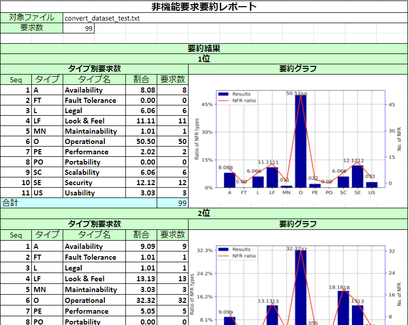

# 非機能要求要求自動要約ツール
 
要求仕様書に含まれる非機能要求を入力として，Convolutional Neural Networkとドメインオントロジーに基づく2つの⾃動⽂書分類技術を組み合せ，⾮機能要求の⾃動分類結果を定量的観点で視覚化することで要約データを⽣成するツールです[1]．

# Requirements
 
* Ubunty 18.04.5 LTS
* Python 3.7.10
* numpy 1.19.5
* gensim 3.6.0
* nltk 3.25
* keras 2.7.0
* tensorflow 2.7.0
* sklearn 0.0
* pandas 1.1.5
* matplotlib 3.2.2

# Usage

## データセットについて
学習データ，テストデータを準備する必要があります．  
・学習データ：/content/drivr/MyDrive/dataset/convert_dataset_train.txt  
・テストデータ：/content/drivr/MyDrive/dataset/convert_dataset_test.txt  

学習データ，テストデータは以下のフォーマットでテキストファイルを作成します．

Ex.)  
```O: This system must operate 24 h a day, 365 days a year.```  
```A: This system ...```  

また正解がわからない要求をテストデータとして扱う場合においても正解ラベルが必要になってしまうので正解ラベルの部分をA(Availability)に固定していただき以下のフォーマットでテキストファイルを作成します．

Ex.)  
```A: 要求記述```  
```A: 要求記述``` 

## 出力データについて
グラフを含めた定量要約結果、各種分類結果の内容は以下のファイルに出力されます。
・定量要約レポート：/content/drivr/MyDrive/output.xlsx
・各要求分類数：/content/drivr/MyDrive/output_reqCount.csv
・分類精度精度：/content/drivr/MyDrive/output_score.csv
・入力データのオントロジー分類確率：/content/drivr/MyDrive/output_ontology.csv
・入力データのCNN分類確率：/content/drivr/MyDrive/output_cnn.csv
・入力データの合議アルゴリズム分類確率：/content/drivr/MyDrive/output_cons.csv

### 各種出力ファイルの説明
定量要約レポート
> ツールを用いて定量要約を行った結果を要約レポートという形で出力したものです。

各要求分類数：/content/drivr/MyDrive/output_reqCount.csv 
> 合議アルゴリズムの分類結果をもとに各タイプの分類数を出力したものです。Terms列のAnsDataは正解ラベル、No1は分類確率1位、No2は分類確率2位、No3は分類確率3位、Top3は分類確率上位3位を示したデータです。

分類精度精度：/content/drivr/MyDrive/output_score.csv 
> CNN、オントロジー、合議アルゴリズムそれぞれで分類を行い各要求の分類精度Passrate(正解率)、precision(各要求ごとの適合率)、Recall(各要求ごとの再現率)、F1Score(各要求ごとのF値)、AnsTop3(上位3位正解率)を出力したものです。

入力データのオントロジー分類確率：/content/drivr/MyDrive/output_ontology.csv 
> 各要求のオントロジー分類確率を出力したものです。No.列の項番はテストデータ(convert_dataset_test.txt)の行数と連動しています。

入力データのCNN分類確率：/content/drivr/MyDrive/output_cnn.csv 
> 各要求のCNN分類確率を出力したものです。No.列の項番はテストデータ(convert_dataset_test.txt)の行数と連動しています。

入力データの合議アルゴリズム分類確率：/content/drivr/MyDrive/output_cons.csv
> 各要求のオントロジー、CNNの分類確率を元に順位付けを行う合議アルゴリズムの結果を出力したものです。No.列の項番はテストデータ(convert_dataset_test.txt)の行数と連動しています。

Ex.)  



## Types of NFR 
|  symbol  |  type  |
| ---- | ---- |
|  A  |  Availability  |
|  FT  |  Fault tolerance  |
|  SC  |  Scalability  |
|  PE  |  Performance  |
|  O  |  Operational  |
|  MN  |  Maintainability  |
|  PO  |  Portability  |
|  SE  |  Security  |
|  LF  |  Look and feel  |
|  US  |  Usability  |
|  L  |  Legal  |

ツールはmain.ipynbをgoogleDriveにアップロードしGoogleColaboratoryを用いて実行します．

# Author

[1] 齋川祐太, 長岡武志, 北川貴之, 位野木万里, Convolutional Neural Networkとドメインオントロジーを用いた定量的視点による非機能要求の要約手法の提案, 第84回情報処理全国大会, 情報処理学会, 2022.